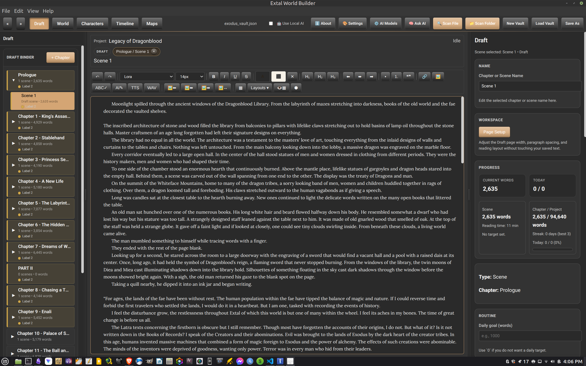
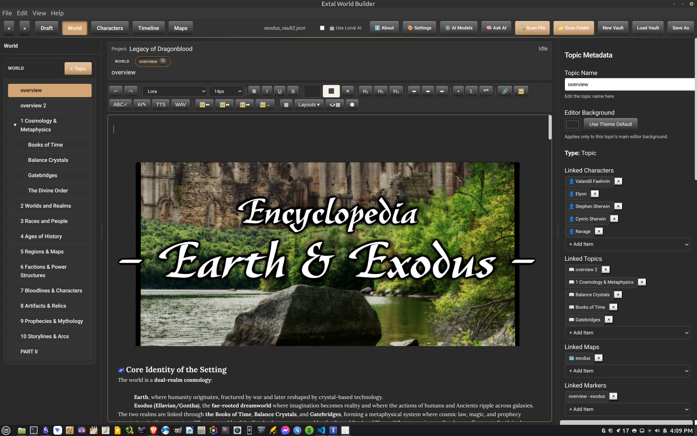
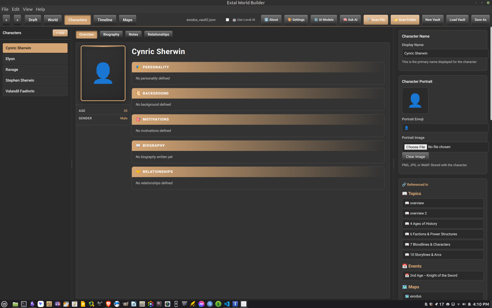
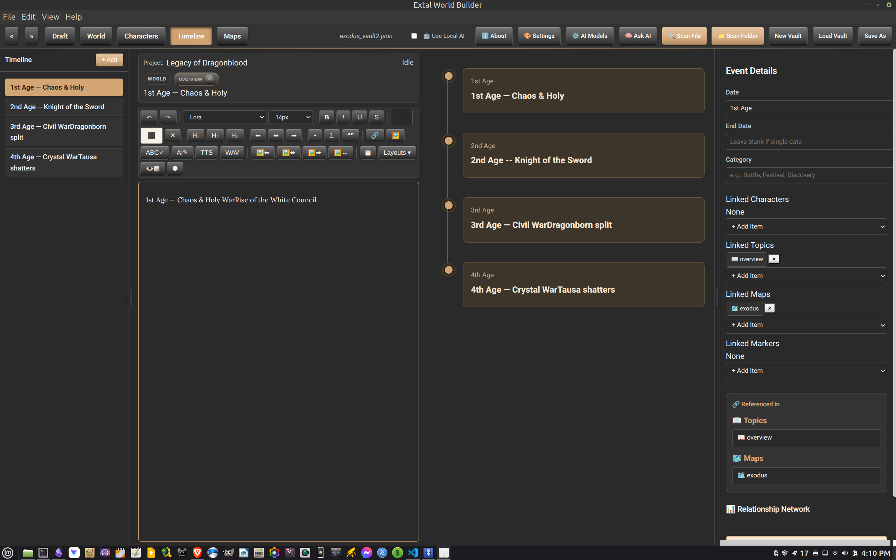
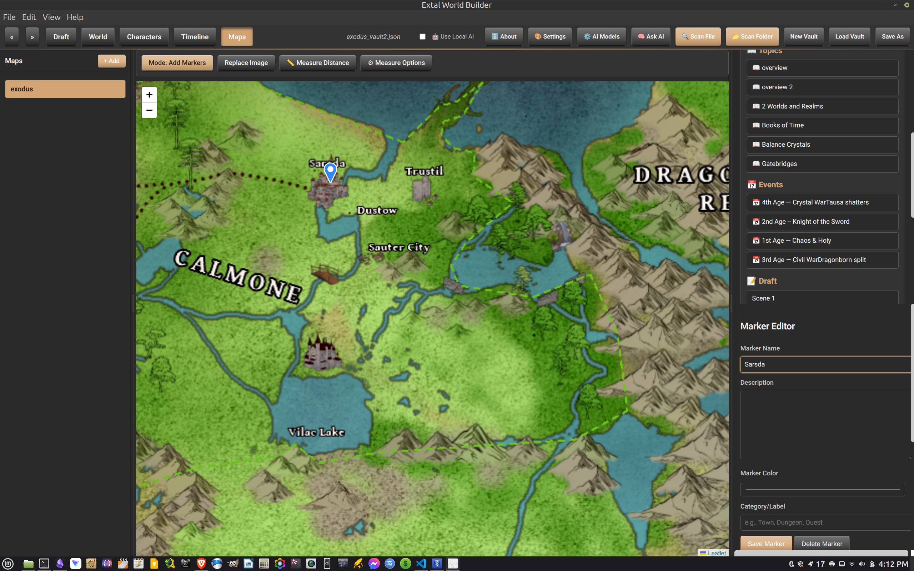
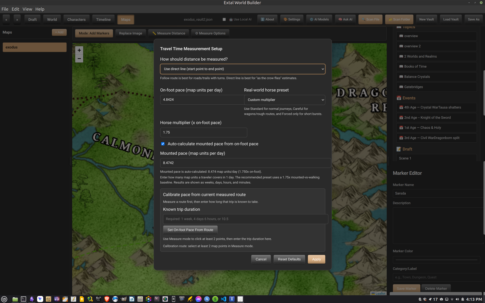
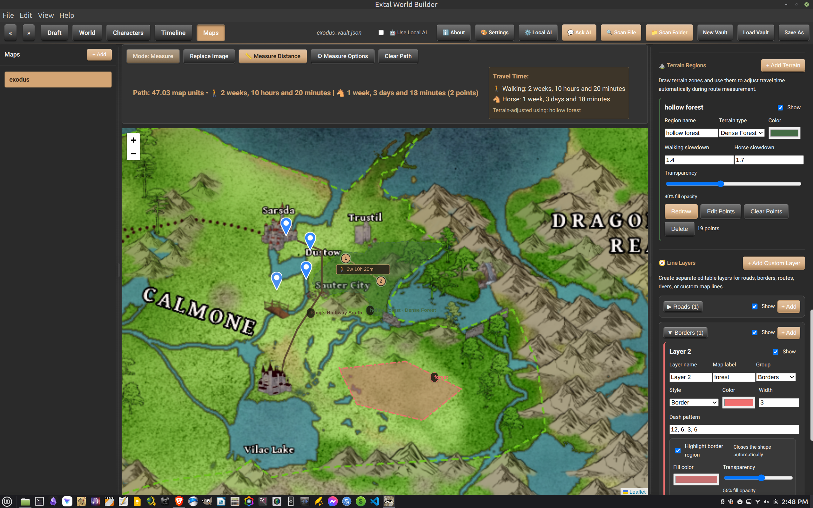

# Extal World Builder

  

  A desktop worldbuilding studio for writers, storytellers, and long-form fiction projects.

  Draft chapters and scenes, build a living encyclopedia, track timeline events, manage characters, and pin story details directly onto maps.

## What The App Does

Extal World Builder is built around one idea: your writing, lore, characters, places, and history should all stay connected while you work.

Inside the app, the major tabs work together:

- `Draft` for chapter and scene writing
- `World` for encyclopedia-style topic building
- `Characters` for profile and relationship tracking
- `Timeline` for event ordering and continuity
- `Maps` for visual location building and marker linking

## App Preview

### Draft

Write scenes in a focused editor with a chapter-and-scene binder on the left and project metadata on the right.

### World

Build a connected reference system for lore, metaphysics, factions, artifacts, regions, and setting structure.

### Characters

Track character identity, biography, motivations, background, and where each person is referenced across the project.

### Timeline

Keep major events ordered visually so story logic and historical continuity are easier to manage.

### Maps

Place markers, connect locations to topics and events, and use built-in measurement tools to support travel and world scale.

## Why It Feels Different

- The writing side and worldbuilding side live in the same app instead of being split across separate tools.
- References are meant to stay navigable, not buried in loose notes.
- The interface is designed for story continuity, not just text storage.
- Server entry: `mcp/extal-mcp-server.js`
- Setup guide: [readme files/LM_STUDIO_MCP_SETUP.md](readme%20files/LM_STUDIO_MCP_SETUP.md)

